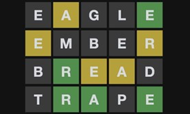

# Wordle

## Overview
Josh Wardle invented "Wordle" and released it to the public in October 2021.  The game has gone viral with millions of active players.  The basic idea is that users get a limited number of guesses to identify an unknown 5-letter reference word.  Users guess the word by entering valid 5-letter words.  Users get feedback on the letters within the word to guide their guesses.  

An example Wordle board is shown below with 4 guesses.  The first guess is on the top line, the second is below, and the last guess is the correct word.

 
## Feedback
- The yellow highlighted letters are in the reference word but not in the right location.  
- Black highlighted letters are not in the reference word.
- Green highlighted letters are in the word and in the correct location.  

File: You are provided with an official list of wordle words ([wordle-official.txt](src/Group1/wordle-official.txt))

You have been tasked with creating an application to play wordle.  The application must consist of a client interface to allow a player to play the game as described along with an administrator interface that can be used by a game administrator to view statistics and adjust the game as needed for difficulty and usability.

## Stakeholders
- User – the player of the game
- Administrator – the system administrator for the game responsible for adjusting the game for difficulty and usability
- Tester – A member of the development team responsible for ensuring the game is free from code bugs

## User Stories
1. As a user, I would like to be able to enter a 5-letter word to be able to tell whether it is a valid word
2. As a user, I would like to see which letters in my word are in the reference word to better tune my guesses
3. As a user, I would like to be able to enter up to 6 guesses to be able to get closer to the right answer
4. As a user, I would like to see a listing of which letters I tried, and which are in the word to be able to better guess the words.
5. As a user, I would like to see the number of guesses it has taken me for the current word, so I can track my progress
6. As a user, I would like to see the average number of guesses it has taken me over the course of using the application, so I can brag to my friends
7. As a user, I would like to see the most commonly guessed letters and words I have used, so I can track my best choices
8. As a user, I would like to ask for a hint to be able to see one correct letter to make it easier for me to find the right word
9. As an administrator, I would like to see what words the user has guessed, so I can track what words are most and least commonly guessed
10. As an administrator, I would like to see what letters are guessed to track most and least commonly guessed
11. As an administrator, I would like to be able to see recommended words based on most and least common guesses to identify more challenging words
12. As an administrator, I would like to be able to change which file is used as the "vocabulary" for the application, so I can use different sets of words
13. As an administrator, I would like to be able to adapt the application to work with sets of words of different lengths to be able to challenge users
14. As an administrator, I would like to allow for an algorithm to automatically pick the words, so I can test an AI solution to the game
15. As a tester, I would like to be able to enter a sequence of words to try as well as a seed word via a text file and get a resulting output in a text file to confirm the functionality of the application 
